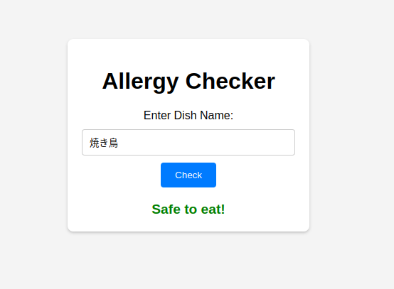

I have many allergies.
Check if I can eat that dish.

```
# backend
$ cp .env.sample .env
$ uv sync
$ . .venv/bin/activate
$ gunicorn backend.app:app --workers 4 --log-level debug --bind 127.0.0.1:8000
```

```
#check the operation of the backend server
$ curl -X POST http://127.0.0.1:8000/check_allergy \
-H "Content-Type: application/json" \
-d '{
    "dish_name": "Peanut Butter Sandwich"
}'
# {"safe_to_eat":false}

```
