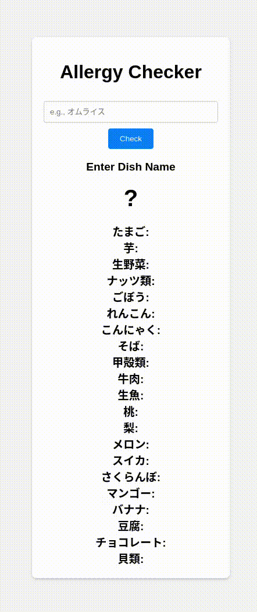

I have many allergies.
Check if I can eat that dish.



```
# Environment Setup
$ cp .env.sample .env
$ uv sync
$ . .venv/bin/activate
```

```
# launch servers
$ ./launch_servers.sh
```

```
#check the operation of the backend server
$ curl "http://127.0.0.1:8000/check_allergy_stream" --get --data-urlencode "dish_name=うどん"
```

```
#check access history
xdg-open http://127.0.0.1:8000/info
```